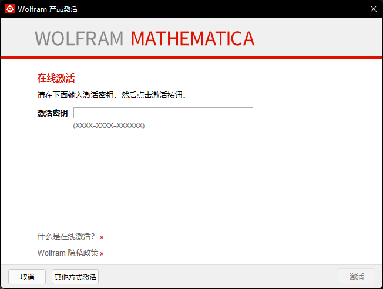

# Mathematica12.x-keygen
针对Mathematica12.x版本的注册机，在12.1 12.2 12.3版本上测试成功

## 使用方法

在 [Releases](https://hub.fastgit.org/lihe07/Mathematica12.x-keygen/releases/) 页面下载最新版本的注册机

使用官网安装包安装Mathematica 12.x版本，第一次启动时，会弹出注册界面。窗口如下：

1. 点击左下角 __"其他方式激活"__ - __"手动激活"__

2. 启动注册机，将窗口中的 __Math ID__ 字段粘贴到注册机内。Math ID的格式应为 __XXXX-XXXXX-XXXXX__。

3. 将注册机生成的激活密钥与密码复制到激活窗口内，并点击右下角 "激活" 按钮。
4. 激活成功

## 免责声明

本注册机 __仅限__ 用于逆向分析学习使用 **不得用于任何非法用途。**

如涉及纠纷，本存储库将被删除。

## 遇到问题？

原理上，不管输入任何字符，程序都会计算出一个结果。

如果提示激活码/密码无效，请检查本注册机是否为最新版本。

并检查粘贴进激活窗口的内容是否包含任何空格。

联系QQ见Github主页。
